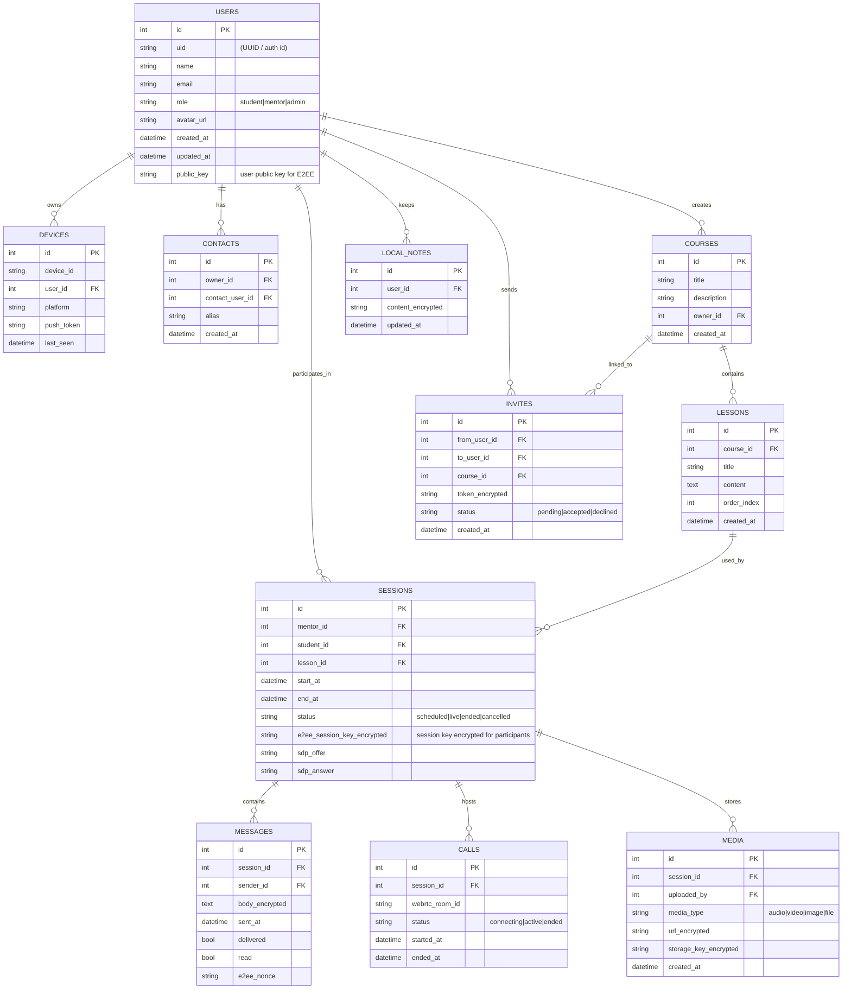

# ERD - server_client_ask

هذا ملف ERD (مخطط العلاقة بين الكيانات) مقترح لمشروع "server_client_ask".
يصوّر الجداول الأساسية والعلاقات المتوقعة لتطبيق تعليمي آمن في الوقت الحقيقي مع دعم E2EE و WebRTC وتخزين محلي.

> ملاحظة: الحقول التي تحمل كلمات مثل "encrypted" أو مفاتيح التشفير تفترض أن القيم مخزنة مشفرة (E2EE) أو مشفرة على الجهاز.

## ملاحظات تنفيذية
- الحقول المؤشر عليها بـ `_encrypted` أو التي تمثل مفاتيح يجب أن تُخزن مشفّرة — إما على الخادم بشكل مشفر أو محليًا كجزء من E2EE.
- جداول `LOCAL_NOTES` و`Devices` تمثل بيانات محفوظة محليًا/على الجهاز؛ قد لا تُرسل كلها للخادم مشفّرة.
- يمكن تعديل هذا المخطط ليتناسب مع بنية API الحالية واشتقاقات SQLite المستخدمة في تطبيق Flutter.

---

تم إنشاء الملف بصيغة Markdown في مسار: `docs/ERD.md`
